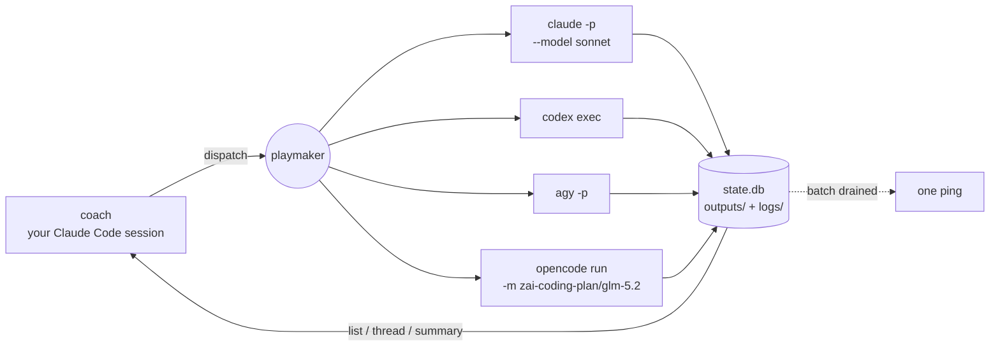

# playmaker

[](https://github.com/vladsafedev/playmaker/actions/workflows/ci.yml)
[](https://pypi.org/project/playmaker-cli/)
[](https://pypi.org/project/playmaker-cli/)
[](LICENSE)

**Run Claude Code, Codex, Antigravity and opencode as parallel sub-agents from one terminal — and spend separate quotas instead of one.**

You stay in your Claude Code session doing the part only you can do. `playmaker`
fans the rest out to other agent CLIs as detached processes, tracks them,
parses their native session files, and pings you when they land.

```console
$ B=dashboard                      # one label for the whole fan-out

$ playmaker dispatch codex  --batch $B -p "Add PATCH /users/:id …"
session: 9f2c1a4e-…  pid: 48211  (detached)
$ playmaker dispatch agy    --batch $B --model gemini-3.6-flash-high -p "pytest coverage for …"
session: 4b1f9c02-…  pid: 48219  (detached)
$ playmaker dispatch claude --batch $B --model sonnet -p "Update the API docs for …"
session: c07d5511-…  pid: 48244  (detached)

# …you keep working in your own session while those three run

$ playmaker list
┏━━━━━━━━━━┳━━━━━━━━┳━━━━━━━━━┳━━━━━━━━━━━━━━━━━━━━━┳━━━━━━━━━━━━━━━━━━━━━━━━┓
┃ id       ┃ agent  ┃ status  ┃ started             ┃ prompt                 ┃
┡━━━━━━━━━━╇━━━━━━━━╇━━━━━━━━━╇━━━━━━━━━━━━━━━━━━━━━╇━━━━━━━━━━━━━━━━━━━━━━━━┩
│ 9f2c1a4e │ codex  │ running │ 2026-07-27T18:02:09 │ Add PATCH /users/:id … │
│ 4b1f9c02 │ agy    │ done    │ 2026-07-27T18:02:11 │ pytest coverage for …  │
│ c07d5511 │ claude │ done    │ 2026-07-27T18:02:14 │ Update the API docs …  │
└──────────┴────────┴─────────┴─────────────────────┴────────────────────────┘

🔔  playmaker — batch done                    # one ping for the whole fan-out…
    3/3 done · codex ✓ · agy ✓ · claude ✓     # …click it to open every output

$ playmaker summary 9f2c1a4e                  # what codex says it did
$ playmaker continue 9f2c1a4e -p "the 404 branch is missing a test"
```

## Why

Three reasons to fan work out across agent CLIs instead of grinding through it
in one serial session:

1. **Wall-clock speed.** A task that decomposes into 3–5 independent
   work-streams (schema, backend, frontend, tests, docs) finishes 2–4× faster
   when each stream runs as its own parallel agent.
2. **Provider arbitrage.** Codex, Antigravity and opencode quotas are entirely
   separate pools from your Anthropic plan. Every slice you hand them is
   capacity your main session never spends — and Antigravity's roster includes
   Claude Sonnet/Opus, so even Claude-quality work can run on Google's pool.
   `opencode` widens this the most: one CLI fronting ~75 providers, from a z.ai
   GLM coding plan to models running locally on your own machine.
3. **Bucket arbitrage inside one plan.** Headless `claude -p` draws on the same
   subscription as your interactive session, but per-model weekly buckets are
   separate — dispatching `--model sonnet` spends Sonnet's usually-idle bucket
   instead of the scarce Opus one.

The catch: doing this by hand — terminal tabs, jumping between tools,
copy-pasting context — is friction. `playmaker` removes the friction; the
[coach skill](#the-coach-skill) provides the discipline.

## Permissions

A detached agent has nobody at the keyboard to approve a tool prompt, so you
decide up front what it may do. Left alone, a headless Claude simply answers
*"I need your permission"* and finishes having changed nothing — so the choice
is real, not a formality.

By default playmaker asks for the weakest setting that still lets the work
finish: **the agent is free inside the directory you dispatched it to, and
Claude itself refuses anything outside it.**

| `[agents.claude] permission_mode` | inside `--cwd` | outside `--cwd` |
|---|---|---|
| `"plan"` | reads and plans, no writes | — |
| `"acceptEdits"` *(default)* | edits files, runs commands | refused |
| `"bypassPermissions"` | anything | anything |

Narrow it further with an allowlist — Claude Code's own tool syntax:

```toml
[agents.claude]
permission_mode = "acceptEdits"
allowed_tools = ["Read", "Edit", "Write", "Bash(pytest:*)"]
disallowed_tools = ["WebFetch"]
```

**Or skip the whole thing.** One line, no boundary, including the
working-directory one:

```toml
[agents.claude]
yolo = true
```

That is a reasonable trade for prompts and directories you'd run unattended
anyway — just make it a decision rather than a default you inherited.

The other agents differ, because their CLIs do:

- **codex** needs none of this. `codex exec` is already non-interactive and
  sandboxes the model's shell itself, so playmaker passes no bypass flag at
  all. Override its policy with `sandbox = "read-only" | "workspace-write" |
  "danger-full-access"`.
- **agy** has no middle tier — no per-mode flag exists, so a detached run
  either auto-approves or comes back having done nothing. It therefore
  defaults to `yolo = true`; layer `sandbox = true` on top for agy's own
  terminal restrictions.
- **opencode** is the same story: its only lever is `--auto`, so it also
  defaults to `yolo = true`. The granular control lives in opencode's own
  config rather than in playmaker — and `--auto` still honours it, because it
  auto-approves only what you have not explicitly denied:

  ```jsonc
  // ~/.config/opencode/opencode.json
  { "permission": { "edit": "allow", "bash": "allow", "webfetch": "deny" } }
  ```

- **gemini** (legacy) runs with `--yolo`.

## Install

```bash
uv tool install playmaker-cli        # or: pipx install playmaker-cli
```

<details>
<summary>From source</summary>

```bash
git clone https://github.com/vladsafedev/playmaker
cd playmaker
uv tool install --editable .
```

</details>

Then set up the data directory and install the coach skill:

```bash
playmaker init            # creates ~/.playmaker/ (state.db, logs/, outputs/, config.toml)
playmaker skill install   # drops playmaker-coach into ~/.claude/skills/
playmaker agents          # which agent CLIs are reachable
```

## Prerequisites

`playmaker` orchestrates external CLIs — install whichever you have access to:

| Agent | Install | Notes |
|---|---|---|
| **Claude Code** | `npm i -g @anthropic-ai/claude-code` | `--model sonnet` / `opus` / `haiku` |
| **Codex CLI** | `npm i -g @openai/codex` | the model roster depends on your plan; omit `--model` to use the account default |
| **Antigravity (`agy`)** | bundled with [Antigravity](https://antigravity.google) | `--model claude-opus-4-6-thinking` — the roster moves, so read it from `agy models` |
| **opencode** | `brew install sst/tap/opencode` (or see [opencode.ai](https://opencode.ai)) | `--model provider/model`, e.g. `zai-coding-plan/glm-5.2`; roster from `opencode models`, providers from `opencode auth login` |
| **Gemini CLI** (legacy) | `npm i -g @google/gemini-cli` | still supported, superseded by `agy` |

At least one is required; `playmaker agents` tells you which it can see.

## The coach skill

`playmaker` is the runner. The decision-making — *when* delegation beats doing
it yourself, *which* agent gets *which* slice, how to size a subtask so
reviewing it is cheap — lives in
[**playmaker-coach**](skills/playmaker-coach/SKILL.md), a Claude Code skill
that ships with the package:

```bash
playmaker skill install     # ~/.claude/skills/playmaker-coach/
```

Then give any Claude Code session a task that changes code and it activates:
proposes a split into work packages with per-model quota rationale, waits for
your approval, fans out, and — this is the second half of the loop — puts every
resulting diff through a **review board** before it lands.

The skill installs as a directory: `SKILL.md` is the protocol, `references/`
holds the parts the coach loads on demand, and `scripts/review-board.sh` is the
review fan-out.

### The review board

Reviewing a diff carefully is the most expensive thing a coach can do with its
own context, and it has an objective output — findings with evidence. So it is
delegated too. One command snapshots the work package's diff, hands it to
independent reviewer agents on different lanes (each with a distinct lens:
correctness, contracts, risk, conventions), and asks each to *refute* the
implementation against its acceptance criteria:

```bash
review-board.sh <wp> <base-ref> --risk normal --gate "npm run typecheck" --impl-agent codex
review-board.sh --collect <wp>
```

Reviewers run `--read-only` and return a fixed JSON verdict — severity, file,
line, and a concrete failure scenario per finding. The coach reads verdicts
rather than code, arbitrates, and sends a numbered fix list back into the
implementer's live session with `playmaker continue`. Which lanes review which
risk class is configuration, in `.playmaker/reviewers.conf`.

### Policy lives outside the skill

Before planning, the coach reads `./.playmaker/policy.md` (repo) and
`~/.playmaker/policy.md` (personal) and lets them override the skill's defaults
— which quotas to spare, which lanes are contended, what juniors may never
touch in this repo, which commands are the acceptance gates. Keep your own
rules there and `playmaker skill install --force` stays a safe upgrade.

## Commands

```bash
playmaker agents                              # who's installed
playmaker quotas [--refresh]                  # capacity per provider, per model

playmaker dispatch <agent> --prompt "..."     # detached by default
                  [--model NAME]              # forwarded to the agent's own CLI
                  [--cwd DIR]
                  [--files PATH...]
                  [--expect-changes|--read-only]
                  [--sync]                    # block and print the final answer
                  [--parent ID]               # link lineage to an earlier session
                  [--batch LABEL]             # group a fan-out; one summary ping
playmaker continue <id> --prompt "..."        # follow-up inside the live session
                  [--model NAME] [--files PATH...] [--expect-changes|--read-only] [--sync]

playmaker list [--status running|done|failed|no_changes] [--agent NAME] [--limit N]
playmaker get <id> [--wait] [--poll SECONDS]
playmaker summary <id>                        # last 2 assistant messages
playmaker thread <id> [--last N] [--all] [--role assistant|user|tool]
                     [--include-tools] [--max-bytes N] [--follow]
playmaker logs <id> [--follow]                # subprocess stdout for detached runs
playmaker kill <id>
playmaker watch                               # live TUI of sessions
playmaker skill install [--dir PATH] [--force]
```

`dispatch`, `continue`, `list`, `get`, `thread` and `quotas` all take `--json`
for scripting.

Write-shaped prompts are checked for file changes at completion. A zero-change
write task becomes `no_changes`; use `--read-only` for recon or answer-only
work, or `--expect-changes` to force the check for an otherwise ambiguous prompt.

**`continue` vs a fresh `dispatch`.** `continue` sends a follow-up into the
agent's existing session, so its reasoning, tool history and file context are
still live — that's the cheap path for "almost right, fix Y". Start fresh with
`--parent <id>` only when the old context has become a liability.

## How it works



Each dispatch is a detached OS process with its own quota; playmaker owns the
bookkeeping in between.

```
~/.playmaker/
├── state.db          SQLite — sessions, status, pids, models, output paths
├── config.toml
├── agents/           optional agent profile markdown (claude.md, codex.md, agy.md…)
├── outputs/          final output per session — .md, or .json if the agent returned JSON,
│                     plus batch-<label>.md, every output in one fan-out combined
├── logs/             subprocess stdout for detached runs
├── opencode/         pointer per opencode session (its transcript lives in SQLite)
└── quotas.json       latest capacity snapshot
```

`dispatch` runs the agent's CLI non-interactively, parses its native output,
and locates the session file the tool writes locally. Empirically:

| Agent | Session transcript |
|---|---|
| Claude | `~/.claude/projects/<cwd-with-slashes-as-dashes>/<id>.jsonl` |
| Codex | `~/.codex/sessions/<YYYY>/<MM>/<DD>/rollout-<ts>-<thread_id>.jsonl` |
| Antigravity | `~/.gemini/antigravity-cli/brain/<conversation-id>/.system_generated/logs/transcript_full.jsonl` |
| opencode | SQLite — `~/.local/share/opencode/opencode.db` (`session` / `message` / `part`); playmaker keeps a pointer at `~/.playmaker/opencode/<id>.session` |
| Gemini | `~/.gemini/tmp/<cwd-basename>/chats/session-<ts>-<short_id>.{json,jsonl}` |

`thread` and `summary` normalize all of them into the same turn list, so every
agent reads back in one shape.

Profiles are optional and discovered, not shipped: drop
`~/.playmaker/agents/<name>.md` (or `./.playmaker/agents/<name>.md` next to a
repo, which wins) and it is prepended to every dispatch for that agent.

Two quirks worth knowing: **agy**'s shell cwd is a private scratch dir rather
than your workspace, so playmaker prepends a workspace preamble to every agy
dispatch; and a wrong `--model` is a silent failure on both **codex** (reports
`turn.failed` while exiting 0) and **agy** (runs its default model instead) —
playmaker turns both into real errors.

**opencode** deserves its own note, because one CLI is many providers. Models
are `provider/model` strings from `opencode models`, and if you don't pass
`--model` opencode falls back to the default in *its* config — often whatever
you last picked interactively. Set the lane's default once:

```toml
[agents.opencode]
model = "zai-coding-plan/glm-5.2"
```

It also has agy's working-directory problem in a different costume: opencode
reads `process.env.PWD`, which a subprocess `cwd` does not update, so left
alone it would ignore `--cwd` and write into the directory *you* were standing
in. playmaker passes `--dir` and fixes up `PWD`, so `--cwd` means what it says.

And it is the agent most likely to need `binary`, which every lane accepts:

```toml
[agents.opencode]
binary = "~/.opencode/bin/opencode"
```

A bare name is resolved on `PATH`; a path is used as-is. opencode installs to
`~/.opencode/bin`, which reaches `PATH` only via a line in an interactive
`.zshrc` — so a dispatch from cron, an editor, or the coach can't find it
otherwise, and playmaker would report the agent as unavailable.

## Notifications

Every detached dispatch pings when it finishes. With
[`terminal-notifier`](https://github.com/julienXX/terminal-notifier) installed
(`brew install terminal-notifier`), the notification is **clickable** and opens
the agent's output file in your editor:

```toml
[notifications]
editor = "Zed"     # any app name `open -a` accepts
```

Without terminal-notifier, playmaker falls back to plain `osascript` banners,
which can't be clicked.

**Batches.** Pass the same `--batch <label>` to every dispatch in a fan-out and
per-dispatch success pings are suppressed — one "N/N done" summary fires when
the whole batch drains. Failures are the actionable event, so they still ping
immediately, with a distinct sound (Basso vs. the usual Blow).

Each session's final output lands in `~/.playmaker/outputs/<id>.md` (or `.json`
when the agent returned genuine JSON), so the notification click — and
`playmaker get` — always have a stable file to open.

## Quotas

`playmaker quotas` is token-based: it reads the credentials each CLI already
stores, no scraping and no browser.

```console
$ playmaker quotas --refresh
Claude  Max 20x
  Session     ████████████████░░░░ 80% left   resets in 3h 12m
  Weekly      ███████████░░░░░░░░░ 55% left   resets in 4d 6h
  Sonnet      ███████████████████░ 95% left   resets in 4d 6h

Codex  Plus
  Session     ██████████████████░░ 90% left   resets in 1h 40m
  Weekly      █████████████░░░░░░░ 65% left   resets in 2d 9h

Antigravity (agy)
  Gemini 5h         ████████████████████ 100% left
  Gemini weekly     ███████████████████░ 95% left
  Claude/GPT 5h     ██████████████████░░ 90% left  resets in 2h 05m
  Claude/GPT weekly ██████████████░░░░░░ 70% left  resets in 5d 1h

Z.ai (GLM, via opencode)  Max
  Session     ████████████████████ 100% left
  Weekly      ███████████████████░ 95% left   resets in 1d 11h
  MCP tools   ███████████████████░ 99% left   resets in 25d 11h
```

The `Weekly` and `Sonnet` rows above are the point: they are **separate
buckets**. So is every agy row, and so is the whole Z.ai block. Routing a
subtask is choosing which of them to spend.

- **Claude** — OAuth usage API; token from the Claude Code Keychain entry.
- **Codex** — ChatGPT `wham/usage` API; token from `~/.codex/auth.json`.
- **Antigravity** — prefers agy's **local daemon**
  (`RetrieveUserQuotaSummary` over its embedded gRPC-web endpoint), which is
  the only source for the full categorized breakdown above. Works whenever any
  agy process has the singleton daemon up. Falls back to the OAuth
  `retrieveUserQuota` on the Antigravity backend, which surfaces only coarse
  Gemini buckets and is flagged *daemon offline*. Approach ported from
  [steipete/CodexBar](https://github.com/steipete/CodexBar).
- **Z.ai** — GLM Coding Plan usage API; key from opencode's
  `~/.local/share/opencode/auth.json` (or `$ZAI_API_KEY`). Reported as its own
  provider because the quota belongs to the plan, not to opencode — an opencode
  lane pointed at a local model spends nothing here. Shows *unsupported* rather
  than an error when no Z.ai credential exists. `MCP tools` is the monthly
  web-search/reader pool, not inference.

Reading these at *model* granularity is the point: they are the load-balancing
input the coach skill uses to route each subtask.

## Limitations

- macOS-only for the Claude quota probe (reads the Claude Code Keychain entry)
  and for notifications. Everything else works on Linux.
- No remote agents — everything runs as a local subprocess on your machine.
- Quota probes read undocumented endpoints the vendors can change at any time.

## Contributing

Handlers for other agent CLIs are especially welcome — see
[CONTRIBUTING.md](CONTRIBUTING.md) for the `AgentHandler` contract and what you
need to know about a CLI before writing one.
[SECURITY.md](SECURITY.md) covers which credentials the quota probes read and
what a dispatched agent is allowed to do.

```bash
uv run pytest
uv run ruff check .
```

## License

MIT. See [LICENSE](LICENSE).
