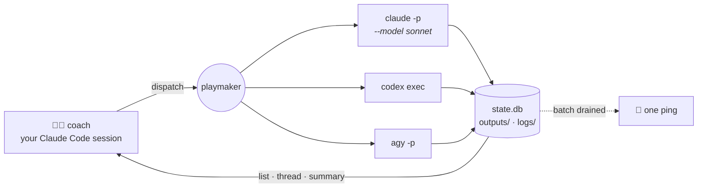

# playmaker

[](https://github.com/vladsafedev/playmaker/actions/workflows/ci.yml)
[](https://pypi.org/project/playmaker-cli/)
[](https://pypi.org/project/playmaker-cli/)
[](LICENSE)

**Run Claude Code, Codex and Antigravity as parallel sub-agents from one terminal — and spend three separate quotas instead of one.**

You stay in your Claude Code session doing the part only you can do. `playmaker`
fans the rest out to other agent CLIs as detached processes, tracks them,
parses their native session files, and pings you when they land.

```console
$ B=dashboard                      # one label for the whole fan-out

$ playmaker dispatch codex  --batch $B --model gpt-5-codex -p "Add PATCH /users/:id …"
session: 9f2c1a4e-…  pid: 48211  (detached)
$ playmaker dispatch agy    --batch $B --model "Gemini 3.5 Flash (High)" -p "pytest coverage for …"
session: 4b1f9c02-…  pid: 48219  (detached)
$ playmaker dispatch claude --batch $B --model sonnet -p "Update the API docs for …"
session: c07d5511-…  pid: 48244  (detached)

# …you keep working in your own session while those three run

$ playmaker list
┏━━━━━━━━━━┳━━━━━━━━┳━━━━━━━━━┳━━━━━━━━━━━━━━━━━━━━━┳━━━━━━━━━━━━━━━━━━━━━━━━┓
┃ id       ┃ agent  ┃ status  ┃ started             ┃ prompt                 ┃
┡━━━━━━━━━━╇━━━━━━━━╇━━━━━━━━━╇━━━━━━━━━━━━━━━━━━━━━╇━━━━━━━━━━━━━━━━━━━━━━━━┩
│ 9f2c1a4e │ codex  │ running │ 2026-07-27T18:02:09 │ Add PATCH /users/:id … │
│ 4b1f9c02 │ agy    │ done    │ 2026-07-27T18:02:11 │ pytest coverage for …  │
│ c07d5511 │ claude │ done    │ 2026-07-27T18:02:14 │ Update the API docs …  │
└──────────┴────────┴─────────┴─────────────────────┴────────────────────────┘

🔔  playmaker — batch done                    # one ping for the whole fan-out…
    3/3 done · codex ✓ · agy ✓ · claude ✓     # …click it to open every output

$ playmaker summary 9f2c1a4e                  # what codex says it did
$ playmaker continue 9f2c1a4e -p "the 404 branch is missing a test"
```

## Why

Three reasons to fan work out across agent CLIs instead of grinding through it
in one serial session:

1. **Wall-clock speed.** A task that decomposes into 3–5 independent
   work-streams (schema, backend, frontend, tests, docs) finishes 2–4× faster
   when each stream runs as its own parallel agent.
2. **Provider arbitrage.** Codex and Antigravity quotas are entirely separate
   pools from your Anthropic plan. Every slice you hand them is capacity your
   main session never spends — and Antigravity's roster includes Claude
   Sonnet/Opus, so even Claude-quality work can run on Google's pool.
3. **Bucket arbitrage inside one plan.** Headless `claude -p` draws on the same
   subscription as your interactive session, but per-model weekly buckets are
   separate — dispatching `--model sonnet` spends Sonnet's usually-idle bucket
   instead of the scarce Opus one.

The catch: doing this by hand — terminal tabs, jumping between tools,
copy-pasting context — is friction. `playmaker` removes the friction; the
[coach skill](#the-coach-skill) provides the discipline.

## ⚠️ Sub-agents skip permission prompts by default

By default, playmaker launches Claude and Antigravity sub-agents with
`--dangerously-skip-permissions` (and Gemini with `--yolo`). This is
deliberate: a headless agent has no human at the keyboard, so without these
flags a detached run stalls at the first tool-approval prompt and finishes
having written nothing.

It also means a dispatched agent can run commands and edit files **without
asking**. Only dispatch prompts you'd be comfortable running unattended, in
working directories you trust.

To opt out for Claude, set this in `~/.playmaker/config.toml`:

```toml
[agents.claude]
skip_permissions = false
```

— with the caveat above: detached runs will then stall on the first permission
prompt, so this only really makes sense alongside `--sync` workflows or
allowlist rules you've configured in Claude Code itself.

## Install

```bash
uv tool install playmaker-cli        # or: pipx install playmaker-cli
```

<details>
<summary>From source</summary>

```bash
git clone https://github.com/vladsafedev/playmaker
cd playmaker
uv tool install --editable .
```

</details>

Then set up the data directory and install the coach skill:

```bash
playmaker init            # creates ~/.playmaker/ (state.db, logs/, outputs/, config.toml)
playmaker skill install   # drops playmaker-coach into ~/.claude/skills/
playmaker agents          # which agent CLIs are reachable
```

## Prerequisites

`playmaker` orchestrates external CLIs — install whichever you have access to:

| Agent | Install | Notes |
|---|---|---|
| **Claude Code** | `npm i -g @anthropic-ai/claude-code` | `--model sonnet` / `opus` / `haiku` |
| **Codex CLI** | `npm i -g @openai/codex` | `--model gpt-5-codex` |
| **Antigravity (`agy`)** | bundled with [Antigravity](https://antigravity.google) | models are display names: `--model "Claude Opus 4.6 (Thinking)"` — see `agy models` |
| **Gemini CLI** (legacy) | `npm i -g @google/gemini-cli` | still supported, superseded by `agy` |

At least one is required; `playmaker agents` tells you which it can see.

## The coach skill

`playmaker` is the runner. The decision-making — *when* delegation beats doing
it yourself, *which* agent gets *which* slice, how to size a subtask so
reviewing it is cheap — lives in
[**playmaker-coach**](skills/playmaker-coach/SKILL.md), a Claude Code skill
that ships with the package:

```bash
playmaker skill install     # ~/.claude/skills/playmaker-coach/SKILL.md
```

Then give any Claude Code session a multi-component task and it activates:
proposes a split with per-model quota rationale, waits for your approval, fans
out, and reviews what comes back.

## Commands

```bash
playmaker agents                              # who's installed
playmaker quotas [--refresh]                  # capacity per provider, per model

playmaker dispatch <agent> --prompt "..."     # detached by default
                  [--model NAME]              # forwarded to the agent's own CLI
                  [--cwd DIR]
                  [--files PATH...]
                  [--sync]                    # block and print the final answer
                  [--parent ID]               # link lineage to an earlier session
                  [--batch LABEL]             # group a fan-out; one summary ping
playmaker continue <id> --prompt "..."        # follow-up inside the live session
                  [--model NAME] [--files PATH...] [--sync]

playmaker list [--status running|done|failed] [--agent NAME] [--limit N]
playmaker get <id> [--wait] [--poll SECONDS]
playmaker summary <id>                        # last 2 assistant messages
playmaker thread <id> [--last N] [--all] [--role assistant|user|tool]
                     [--include-tools] [--max-bytes N] [--follow]
playmaker logs <id> [--follow]                # subprocess stdout for detached runs
playmaker kill <id>
playmaker watch                               # live TUI of sessions
playmaker skill install [--dir PATH] [--force]
```

`dispatch`, `continue`, `list`, `get`, `thread` and `quotas` all take `--json`
for scripting.

**`continue` vs a fresh `dispatch`.** `continue` sends a follow-up into the
agent's existing session, so its reasoning, tool history and file context are
still live — that's the cheap path for "almost right, fix Y". Start fresh with
`--parent <id>` only when the old context has become a liability.

## How it works



Each dispatch is a detached OS process with its own quota; playmaker owns the
bookkeeping in between.

```
~/.playmaker/
├── state.db          SQLite — sessions, status, pids, models, output paths
├── config.toml
├── agents/           optional agent profile markdown (claude.md, codex.md, agy.md…)
├── outputs/          final output per session — .md, or .json if the agent returned JSON
├── logs/             subprocess stdout for detached runs
└── quotas.json       latest capacity snapshot
```

`dispatch` runs the agent's CLI non-interactively, parses its native output,
and locates the session file the tool writes locally. Empirically:

| Agent | Session transcript |
|---|---|
| Claude | `~/.claude/projects/<cwd-with-slashes-as-dashes>/<id>.jsonl` |
| Codex | `~/.codex/sessions/<YYYY>/<MM>/<DD>/rollout-<ts>-<thread_id>.jsonl` |
| Antigravity | `~/.gemini/antigravity-cli/brain/<conversation-id>/.system_generated/logs/transcript_full.jsonl` |
| Gemini | `~/.gemini/tmp/<cwd-basename>/chats/session-<ts>-<short_id>.{json,jsonl}` |

`thread` and `summary` normalize all of them into the same turn list, so every
agent reads back in one shape.

Profiles are optional and discovered, not shipped: drop
`~/.playmaker/agents/<name>.md` (or `./.playmaker/agents/<name>.md` next to a
repo, which wins) and it is prepended to every dispatch for that agent.

Two quirks worth knowing: **agy**'s shell cwd is a private scratch dir rather
than your workspace, so playmaker prepends a workspace preamble to every agy
dispatch; and a wrong `--model` is a silent failure on both **codex** (reports
`turn.failed` while exiting 0) and **agy** (runs its default model instead) —
playmaker turns both into real errors.

## Notifications

Every detached dispatch pings when it finishes. With
[`terminal-notifier`](https://github.com/julienXX/terminal-notifier) installed
(`brew install terminal-notifier`), the notification is **clickable** and opens
the agent's output file in your editor:

```toml
[notifications]
editor = "Zed"     # any app name `open -a` accepts
```

Without terminal-notifier, playmaker falls back to plain `osascript` banners,
which can't be clicked.

**Batches.** Pass the same `--batch <label>` to every dispatch in a fan-out and
per-dispatch success pings are suppressed — one "N/N done" summary fires when
the whole batch drains. Failures are the actionable event, so they still ping
immediately, with a distinct sound (Basso vs. the usual Blow).

Each session's final output lands in `~/.playmaker/outputs/<id>.md` (or `.json`
when the agent returned genuine JSON), so the notification click — and
`playmaker get` — always have a stable file to open.

## Quotas

`playmaker quotas` is token-based: it reads the credentials each CLI already
stores, no scraping and no browser.

```console
$ playmaker quotas --refresh
Claude  Max 20x
  Session     ████████████████░░░░ 80% left   resets in 3h 12m
  Weekly      ███████████░░░░░░░░░ 55% left   resets in 4d 6h
  Sonnet      ███████████████████░ 95% left   resets in 4d 6h

Codex  Plus
  Session     ██████████████████░░ 90% left   resets in 1h 40m
  Weekly      █████████████░░░░░░░ 65% left   resets in 2d 9h

Antigravity (agy)
  Gemini 5h         ████████████████████ 100% left
  Gemini weekly     ███████████████████░ 95% left
  Claude/GPT 5h     ██████████████████░░ 90% left  resets in 2h 05m
  Claude/GPT weekly ██████████████░░░░░░ 70% left  resets in 5d 1h
```

The `Weekly` and `Sonnet` rows above are the point: they are **separate
buckets**. So is every agy row. Routing a subtask is choosing which of them to
spend.

- **Claude** — OAuth usage API; token from the Claude Code Keychain entry.
- **Codex** — ChatGPT `wham/usage` API; token from `~/.codex/auth.json`.
- **Antigravity** — prefers agy's **local daemon**
  (`RetrieveUserQuotaSummary` over its embedded gRPC-web endpoint), which is
  the only source for the full categorized breakdown above. Works whenever any
  agy process has the singleton daemon up. Falls back to the OAuth
  `retrieveUserQuota` on the Antigravity backend, which surfaces only coarse
  Gemini buckets and is flagged *daemon offline*. Approach ported from
  [steipete/CodexBar](https://github.com/steipete/CodexBar).

Reading these at *model* granularity is the point: they are the load-balancing
input the coach skill uses to route each subtask.

## Limitations

- macOS-only for the Claude quota probe (reads the Claude Code Keychain entry)
  and for notifications. Everything else works on Linux.
- No remote agents — everything runs as a local subprocess on your machine.
- Quota probes read undocumented endpoints the vendors can change at any time.

## Contributing

Handlers for other agent CLIs are especially welcome — see
[CONTRIBUTING.md](CONTRIBUTING.md) for the `AgentHandler` contract and what you
need to know about a CLI before writing one.

```bash
uv run pytest
uv run ruff check .
```

## License

MIT. See [LICENSE](LICENSE).
